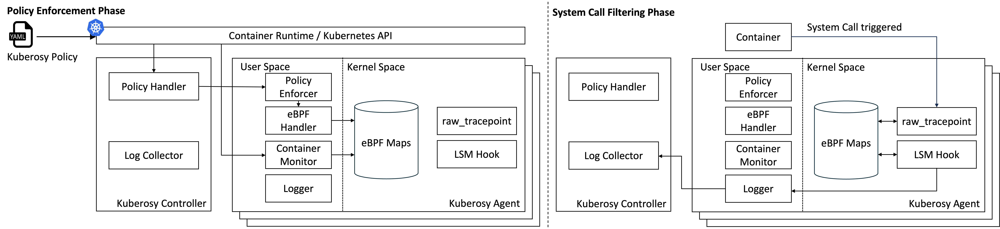

# KubeRosy

## About



KubeRosy는 eBPF와 LSM Hook을 이용하여 컨테이너에서 실행하는 시스템 콜에 대하여 인자값 기반 필터링을 제공하는 컨테이너 특화된 시스템 콜 보안 도구입니다. 

사용자가 KubeRosy Policy를 배포하면, 이를 감지하여 정책의 Selector와 일치하는 컨테이너에 대하여 시스템 콜 보안 정책을 적용하고 커널 수준에서 정책을 시행합니다.

다음은 `name = nginx` 인 컨테이너에서 socket 시스템 콜을 `Block`하는 KubeRosyPolicy의 예시입니다:

```yaml
apiVersion: security.kuberosy.com/v1
kind: KubeRosyPolicy
metadata:
    name: nginx
spec:
    selector:
        matchLabels:
            name: nginx
    action: Block
    syscall:
        - name: socket
```

